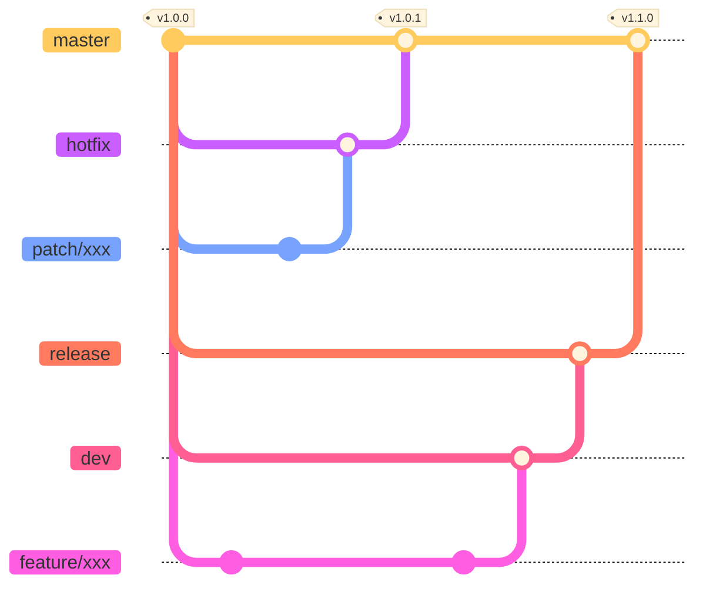
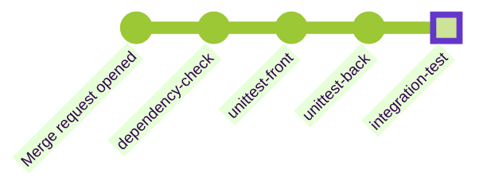
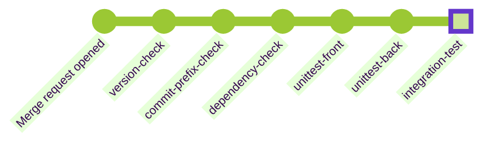
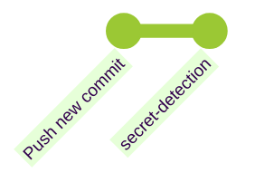
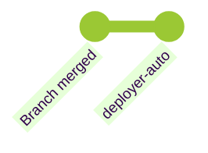
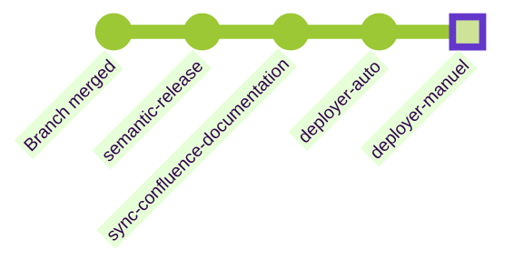

<!-- PROJECT LOGO -->
<br />
<div align="center">
  <a href="https://git.emundus.io/emundus/saas/app_tchooz" style="display: flex;justify-content: center;align-items: center;gap: 16px">
    
  </a>

<h3 align="center">eMundus</h3>

  <p align="center">
    Online application management for Joomla 5.x.x
    <br />
    <a href="https://emundus.atlassian.net/wiki/spaces/HD/overview"><strong>Explore the docs »</strong></a>
    <br />
    <br />
    <a href="https://git.emundus.io/emundus/cms/core/-/issues">Report Bug</a>
    ·
    <a href="https://git.emundus.io/emundus/cms/core/-/issues">Request Feature</a>
  </p>
</div>


<!-- TABLE OF CONTENTS -->
<details>
  <summary>Table of Contents</summary>
  <ol>
    <li>
      <a href="#about-the-project">About The Project</a>
      <ul>
        <li><a href="#built-with">Built With</a></li>
      </ul>
    </li>
    <li>
      <a href="#getting-started">Getting Started</a>
      <ul>
        <li><a href="#prerequisites">Prerequisites</a></li>
        <li><a href="#installation">Installation</a></li>
      </ul>
    </li>
    <li><a href="#gitflow">Gitflow</a></li>
    <li><a href="#release-management">Release management</a></li>
    <li><a href="#roadmap">Roadmap</a></li>
    <li><a href="#acknowledgments">Acknowledgments</a></li>
  </ol>
</details>


<!-- ABOUT THE PROJECT -->

## About The Project

[![Product Name Screen Shot][product-screenshot]](https://demo.tchooz.io)

Manage your application campaigns and calls for proposals simply

* Manage your application programmes, create your application portal and launch your campaign
* Evaluate the content of applications
* Automatic response
* Archive and export campaign data
* Create automatic notifications to your applicants
* Group your files using status and tags
* Manage your user profiles and groups
* Granular rights management
* And much more!

### Built With

[![Joomla][Joomla.com]][Joomla-url]
<br/><br/>
[![Vue][Vue.js]][Vue-url]

<!-- GETTING STARTED -->

## Getting Started

### Prerequisites

#### PHP

[](https://php.net/)

* MacOS : It's recommended to install PHP with homebrew : `brew install php`. You can switch of versions by adding
  `@8.x`.
    * If you need more informations : https://daily-dev-tips.com/posts/installing-php-on-your-mac/

#### NodeJS

[![Node][Node-min-badge]][Node-url]
[![Node][Node-reco-badge]][Node-url]

This project is built with VueJS so it is necessary to have NodeJS installed on your computer.

* MacOS : Download Node [here][Node-url] OR if you use homebrew run following command
    * `brew install node`
* Windows : Download Node [here][Node-url]

#### Composer

Joomla requires an installation of composer.
You can install composer only for this project by following this [documentation][Composer-local-installation].

If you need composer for other project you can install it globally by following
this [chapter][Composer-global-installation].

<p align="right">(<a href="#readme-top">back to top</a>)</p>

<!-- DEV USAGE -->

### For developers

1. Run Hot Reload for VueJS
   ```sh
   yarn run watch
   ```

<p align="right">(<a href="#readme-top">back to top</a>)</p>

#### Seeders

You can login as sysadmin and go to Components > eMundus > Data samples.
This interface allows you to generate users and application files.

<p align="right">(<a href="#readme-top">back to top</a>)</p>

## Installation

### Via docker

You can edit some variables by copying `docker-compose.yml` file

```shell
docker-compose up --build -d
```

## Mise à jour du projet

```shell
php cli/joomla.php tchooz:update
```

## Générer la documentation Back

```shell
phpDocumentor
```

<!-- GITFLOW -->

# Gitflow

## Branches
- **master** : This branch is the main branch. This contains the latest stable version of the application. It is protected and can only be updated by a merge request.
- **hotfix** : This branch is used to prepare the next patch. This is created from the master branch and merged into the master branch. Only minor fixes (style, translations, minor impacts) are allowed to be committed directly in this branch. It's recommended to create a new branch from this one to fix a bug.
- **patch/xxx** : These branches are used to fix a bug. They are created from the master branch and merged into the hotfix branch.
- **release** : This branch is used to prepare the next release. This is created from the dev branch and merged into the master branch.
- **dev** : This branch is used to test new features. This is created from the master branch and merged into the release branch. It's recommended to create a new branch from this one to develop a new feature.
- **feature/xxx** : These branches are used to develop a new feature. They are created from the dev branch and merged into the dev branch.
- **platform/xxx** : These branches are used to deploy a new feature in a specific environment. They are created from the dev branch.

## Simple gitflow



## Complete gitflow
![Gitflow][gitflow]
- **cherry-pick** : This command allows you to apply a commit from another branch. It is useful when you need to apply a security fix from a hotfix branch to a platform branch.

## Pipelines
### Merge request
#### All branches

- **dependency-check** : Check if there is any security issue in the dependencies (npm audit, composer audit)
- **unittest-front** : Run the unit tests for the front part (VueJS)
- **unittest-back** : Run the unit tests for the back part (PHP)
- **integration-test** : Run the integration tests (Playwright). This is optional but can be useful to check if the application is working as expected

#### Master

- **version-check** : Check if the version in the xml file (administrator/components/com_emundus/emundus.xml) was updated since the last release
- **commit-prefix-check** : Check if at least one commit has a prefix (feat, fix, refactor, style, test, chore)
- **dependency-check** : Check if there is any security issue in the dependencies (npm audit, composer audit)
- **unittest-front** : Run the unit tests for the front part (VueJS)
- **unittest-back** : Run the unit tests for the back part (PHP)
- **integration-test** : Run the integration tests (Playwright). This is optional but can be useful to check if the application is working as expected

### Commit
#### All branches

- **secret-detection** : Check if there is any secret in the code

#### Releases

- **deployer-auto** : Deploy the new release in some environments (staging or testing)

#### Master

- **semantic-release** : Create a new version in the master branch with a new tag (X.X.X) and generate release notes with the names of commits since the last version
- **sync-confluence-documentation** : Update Confluence release notes
- **deployer-auto** : Deploy the new release in some environments
- **deployer-manuel** : Allows manual deployment of the new version in other environments

<!-- RELEASES -->

## Release management
We use the Semantic Versioning convention for version numbers. For more information, please visit [semver.org](https://semver.org/).

Each release is therefore named like this: `<major> ‘.’ <minor> ‘.’ <patch>` (example 1.20.4).

`<major>`: The major number indicates the major version of the software, which means that there have been major changes that are potentially incompatible with previous versions.

`<minor>`: The minor number indicates the minor version of the software, meaning that there have been minor changes, such as bug fixes, performance improvements or new features, but which are compatible with previous versions.

`<patch>`: The patch number indicates the patch version of the software. This means that bugs or vulnerabilities have been fixed.

The release number is incremented by checking the names of all the commits included in the history of the merge request or squash commit where applicable.

## Naming convention
> [!WARNING]  
> The prefixes must be used at the beginning of the name of your commits, and the space after the : is essential!

### Are you releasing a major version of the product?
At least one commit must be present in the commit history of your merge request with one of these prefixes:
- `BREAKING:`
- `BREAKING CHANGE:`
- `BREAKING CHANGES:`

> This will trigger the creation of a major release (example 1.0.0 → 2.0.0) when merging to the main branch.

### Are you releasing a feature?
At least one commit must be present in the commit history of your merge request with one of these prefixes:
- `minor:`
- `feat:`
- `feature:`
> This will trigger the creation of a major release (example 1.0.0 → 1.1.0) when merging to the main branch.

### Are you committing a patch or hotfix?
At least one commit must be present in the commit history of your merge request with one of these prefixes:
- `patch:`
- `hotfix:`
- `security:`
- `fix:`
- `style:`
- `refactor:`
- `perf:`
> This will trigger the creation of a major release (example 1.0.0 → 1.0.1) when merging to the main branch.

All the prefixes below will be taken into account in the release creation process when the main branch is merged.

<!-- ROADMAP -->

## Roadmap

https://roadmap.tchooz.app

<p align="right">(<a href="#readme-top">back to top</a>)</p>


<!-- ACKNOWLEDGMENTS -->

## Acknowledgments

Below are several links that are essential for developers working on this project:
* [Joomla](https://developer.joomla.org/)
* [Vue 3](https://vuejs.org/guide/introduction.html)

<p align="right">(<a href="#readme-top">back to top</a>)</p>
<br/>

<br/><p></p><p></p><br/>


<!-- MARKDOWN LINKS & IMAGES -->
<!-- https://www.markdownguide.org/basic-syntax/#reference-style-links -->

[product-screenshot]: images/product-screenshot.png
[gitflow]: images/gitflow.png

[Vue.js]: https://img.shields.io/badge/Vue.js-35495E?style=for-the-badge&logo=vuedotjs&logoColor=4FC08D

[Vue-url]: https://vuejs.org/

[Joomla.com]: https://img.shields.io/badge/Joomla%205.X.X-5091CD?style=for-the-badge&logo=joomla&logoColor=white

[Joomla-url]: https://www.joomla.fr/

[Node-url]: https://nodejs.org/

[Node-min-badge]: https://img.shields.io/badge/min-18.x-orange

[Node-reco-badge]: https://img.shields.io/badge/recommended-20.x-green

[Composer-local-installation]: https://getcomposer.org/download/

[Composer-global-installation]: https://getcomposer.org/doc/00-intro.md#globally

[PHP-url]: https://www.php.net/manual/en/install.macosx.php

[Mailtrap-url]: https://mailtrap.io
