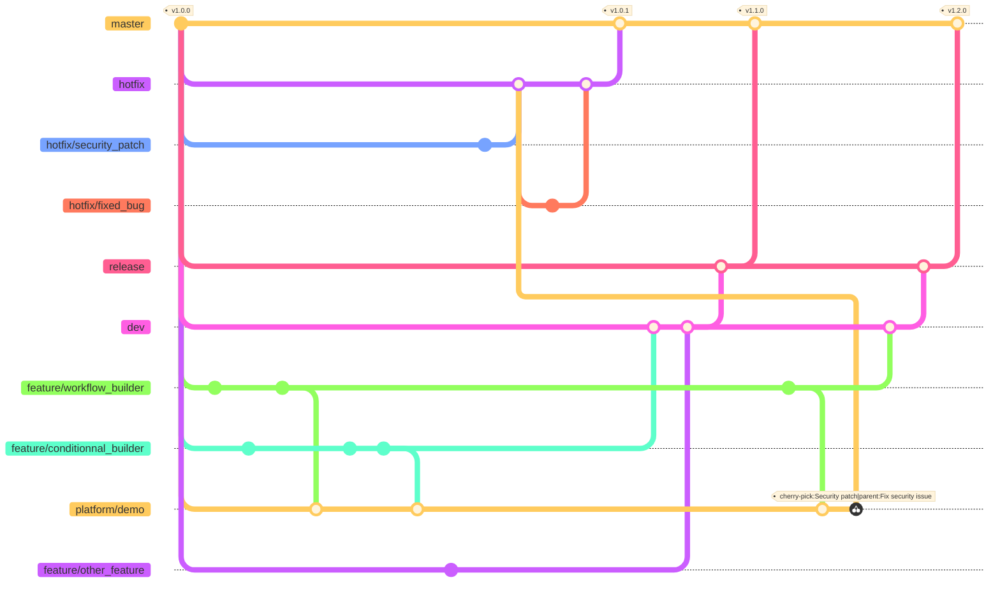

```mermaid
%%{init: { 'logLevel': 'debug', 'theme': 'base', 'gitGraph': {'showBranches': true, 'showCommitLabel':false,'mainBranchName': 'master'}} }%% 
gitGraph
        commit id: "Initial commit" tag: "v1.0.0"
        branch hotfix order: 1
        checkout hotfix
        branch release order: 3
        checkout master
        checkout release
        branch dev order: 4
        checkout dev
        branch feature/workflow_builder order: 5
        checkout feature/workflow_builder
        commit id: "Init workflow builder"
        checkout dev
        branch feature/conditionnal_builder order: 6
        commit id: "Init other feature"
        checkout feature/workflow_builder
        commit id: "Add workflow builder"
        checkout dev
        branch platform/demo order: 7
        checkout platform/demo
        merge feature/workflow_builder
        checkout feature/conditionnal_builder
        commit id: "Add conditionnal builder"
        commit id: "Fix conditionnal builder"
        checkout platform/demo
        merge feature/conditionnal_builder
        checkout dev
        branch feature/other_feature order: 8
        checkout feature/other_feature
        commit id: "Add other feature"
        checkout hotfix
        branch hotfix/security_patch order: 2
        checkout hotfix/security_patch
        commit id: "Fix security issue"
        checkout hotfix
        merge hotfix/security_patch id: "Security patch"
        branch hotfix/fixed_bug order: 2
        checkout hotfix/fixed_bug
        commit id: "Fix bug"
        checkout hotfix
        merge hotfix/fixed_bug
        checkout master
        merge hotfix id: "Release 1.0.1" tag: "v1.0.1"
        checkout dev
        merge feature/conditionnal_builder
        merge feature/other_feature
        checkout release
        merge dev
        checkout master
        merge release id: "Release 1.1.0" tag: "v1.1.0"
        checkout feature/workflow_builder
        commit id: "Add new feature"
        checkout platform/demo
        merge feature/workflow_builder
        cherry-pick id:"Security patch" parent:"Fix security issue"
        checkout dev
        merge feature/workflow_builder
        checkout release
        merge dev
        checkout master
        merge release id: "Release 1.2.0" tag: "v1.2.0"
```